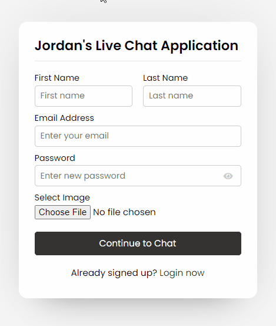
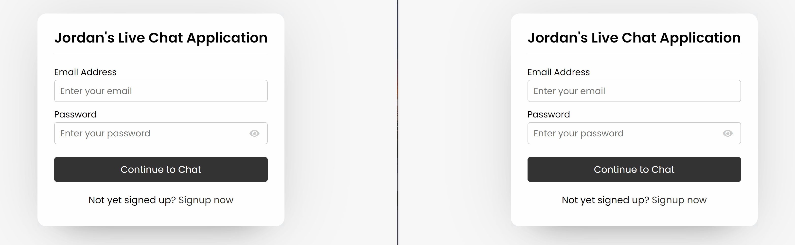
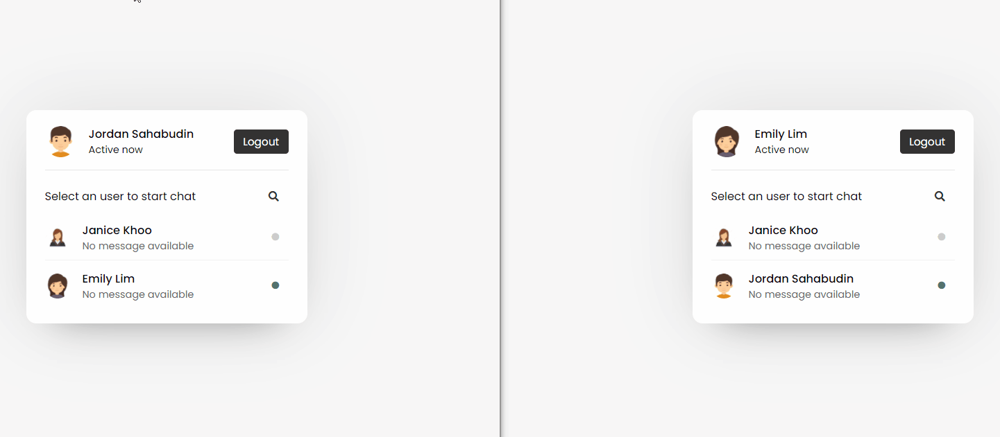

# Live-Chat-Application
Fully responsive live chat system built with PHP, JavaScript and mySQL as back-end database. Multiple users are able to communicate with each other at the same time by utilizing the "Search User" feature within the system. This application can be integrated into various occasions eg: Support System, Enquiry System, E-Commerce Helpdesk.
 

## Getting Started
1. Install  [WAMP](https://www.wampserver.com/en/download-wampserver-64bits/) for MySQL server.

2. Import  [chatapp.sql](/Live-Chat-Application/sql/chatapp.sql) to phpMyAdmin. 

3. Run the program using local host in preferred browser.

4. Please take note that Port 3308 is being used within the config (connection) folder.

## Demo

-----

  <h2>Sign Up</h2>

-----

  <h2>Multiple User Login</h2>

-----

  <h2>Live Chat</h2>

